## Google Cloud Text-to-Speech: Spring boot  
Using the power of ffmpeg/flac/Google and Spring boot here is a simple interface to convert speech to text.

Using a new speech API from Google with the help of this article: https://cloud.google.com/speech-to-text/docs/transcribe-client-libraries

## Quickstart  
### Step 1:  
1- Log on to the Google Cloud Platform console https://console.cloud.google.com  
2- Enable Speech-to-Text on a GCP project. (Make sure billing is enabled for Speech-to-Text)  
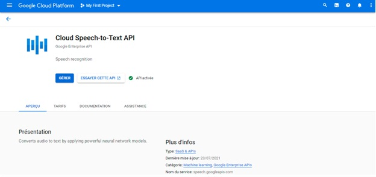

3 - Enable Cloud Translation API.  
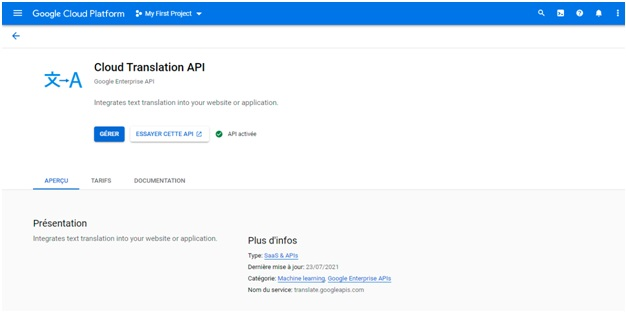

### Step 2: Creating a Service Account Key in the Google Cloud Platform project  
1 - Select the project that you want to monitor. Note down the project ID.  
In this example, the project ID is gcp-mon-dev  
2 - From the left navigation pane, select IAM  and  admin > Service Accounts  
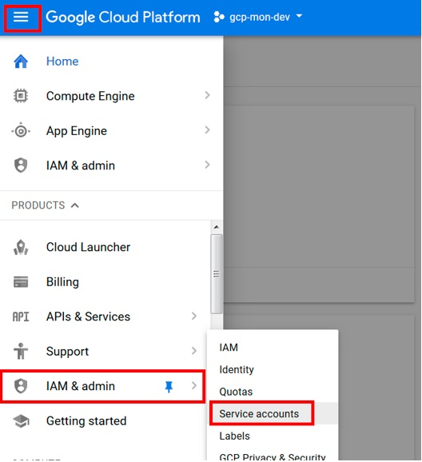

3 - On the Service Accounts page, select CREATE SERVICE ACCOUNT. The Create service account dialog box is displayed. Enter the account name. In Role, select the Project > role.  
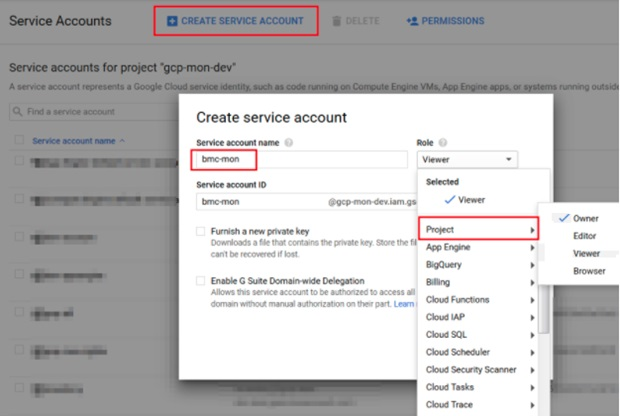

4 - Select the Furnish a new private key check box.  Select the JSON Key type. Click CREATE.  
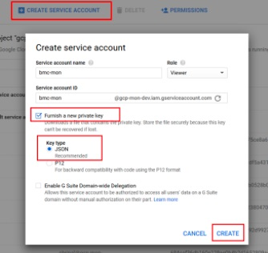

5 - The Service account file is created and downloaded on the computer. Copy this JSON file and place it in the Speech-to-text\src\main\resources directory on the Project  
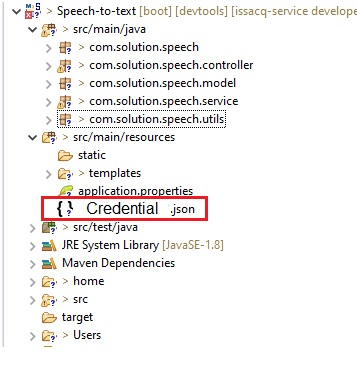

6 – Open application.properties and put the name of your JSON file  
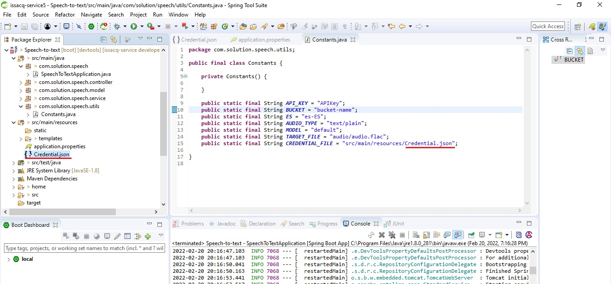

### Step 3: Create A API key  
1 - On GGP home, click on the Navigation Menu.  
Go to APIs & Services option and click on Credentials.  
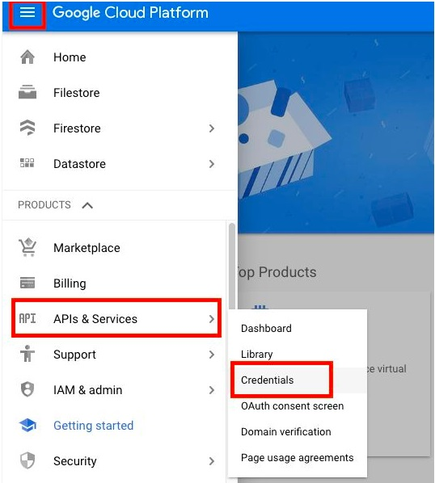

Now click on +CREATE CREDENTIALS.  
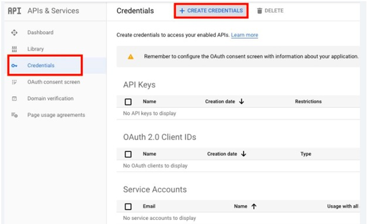

Choose the option API KEY  
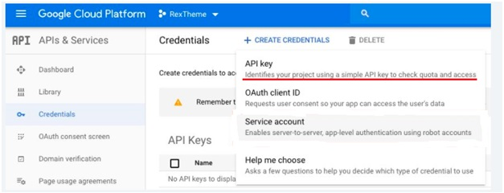

Copy the key  
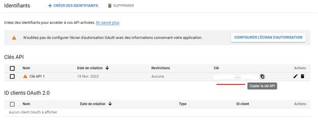

Paste it here  
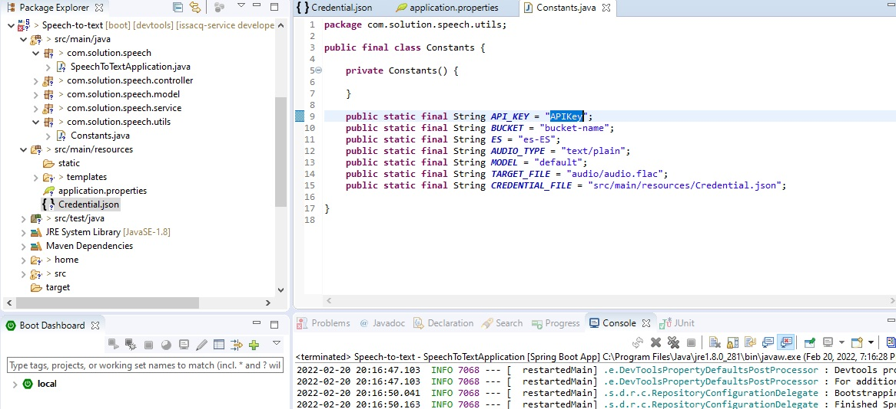

### Step 4: Create New Bucket  
Go to the Navigation Menu > Storage > Browser.  
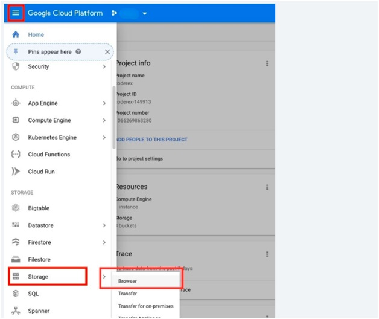

Click on Create Bucket to create a new bucket.  
Copy and paste your bucket name here.  
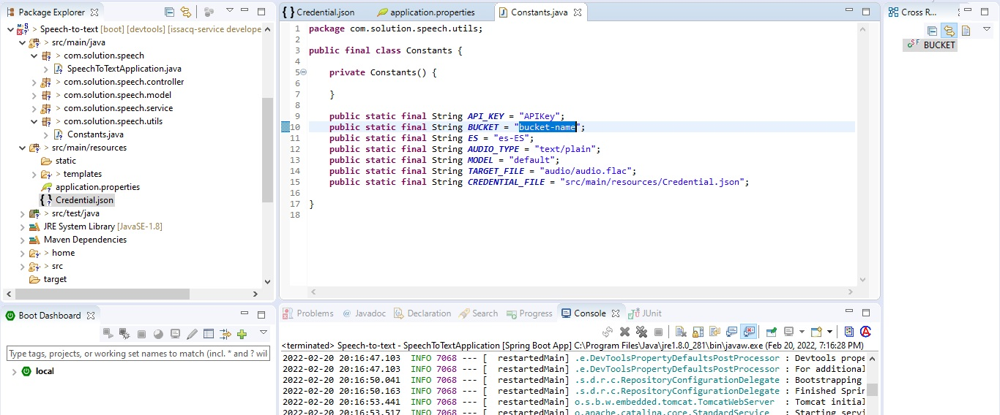

## Run the Spring Boot application  
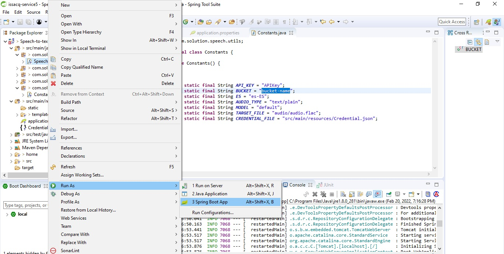

Now, open the browser and invoke the URL http://localhost:8777  
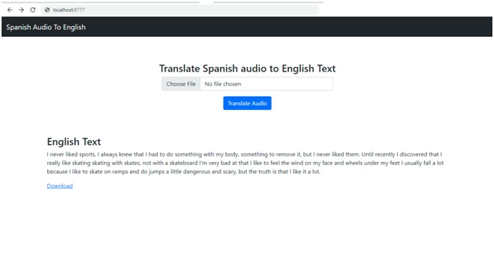

